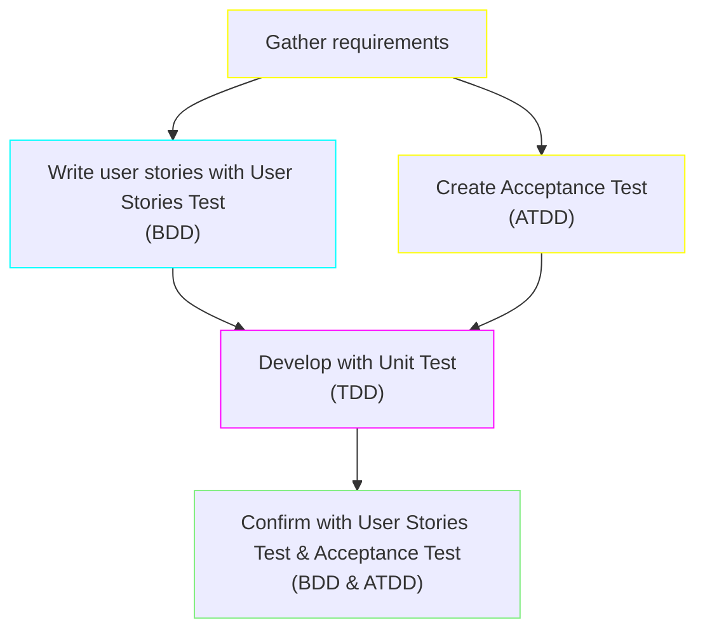

# BrightSocial Test Development Flow

## Introduction
This is the document for a Test Development Flow, which includes Behavior-Driven Development (BDD), Acceptance Test-Driven Development (ATDD) and Test-Driven Development (TDD).

I will show the basic flow of the development process. After that is going to be the ste-by-step of each phase in the whole process.

## The flow of development process

Let's have an example that in the first screen of BrightSocial, we have a phone number input.

##### 1. Gather requirements

<procedure title="User Step" id="user-step">
    <step>
        
Type the phone number

    </step>
    <step>
        
Press <shortcut>Next</shortcut>

    </step>
    <step>
        
The API check the availability

    </step>
    <step>
        
Receive the result through text or dialog

    </step>
</procedure>

##### 2.1. Write user stories with User Stories Test

**Step 1: Define User Stories**

- Start by defining user stories that describe the desired features from the user's perspective. These are typically written in a "Given-When-Then" format.

**Step 2: Write Scenarios**

- For each user story, write scenarios that clearly outline the expected behavior in various situations. These scenarios form the basis for your tests.

**Step 3: Implement Step Definitions**

- Write step definitions for each part of your scenarios. These are the actual test scripts that will be executed.

**Step 4: Write the Code**

- Begin development to make these tests pass. The goal is to write just enough code to pass the test for the current scenario.

**Step 5: Refactor**

- Once the test passes, refactor your code to improve efficiency and readability, ensuring no changes in behavior.

**Step 6: Repeat**

- Continue this process for each scenario until all features described in the user stories are implemented and tested.

##### 2.2. Create Acceptance Test

**Step 1: Define Acceptance Criteria**

- Collaborate with stakeholders to define clear acceptance criteria for each feature. These criteria determine when a feature is considered complete.

**Step 2: Create Acceptance Tests**

- Write automated acceptance tests based on the criteria. These tests should fail initially since the feature isn't implemented yet.

**Step 3: Implement the Feature**

- Develop the feature with the goal of making the acceptance test pass. This often involves both writing new code and refactoring existing code.

**Step 4: Run Tests and Refactor**

- Continuously run the acceptance tests to guide development. Once the tests pass, refactor your code for better structure and readability.

**Step 5: Review and Adjust**

- Review the implementation with stakeholders. Adjust the feature and tests as needed based on feedback.

##### 3. Develop with Unit Test

**Step 1: Write a Test**

- Start by writing a test for a small piece of functionality. This test should fail initially (Red phase).

**Step 2: Write the Minimum Code**

- Write just enough code to make the test pass (Green phase). The focus here is on functionality, not perfection.

**Step 3: Refactor**

- Refactor the code to improve its structure and efficiency (Refactor phase), while ensuring that it still passes the test.

**Step 4: Repeat**

- Continue this process, adding more tests and expanding the functionality step by step. After each test, follow up with the necessary code and refactoring.

**Step 5: Continuous Integration**

- Regularly integrate your code into the main branch and run all tests to ensure that new changes haven't broken anything.

In your document, it's important to emphasize that these methodologies are iterative - they involve continuously cycling through these steps, gradually building up the software in small increments. This ensures that development is closely aligned with user requirements and that the software is thoroughly tested at every stage.

##### 4. Confirm with User Stories Test & Acceptance Test

