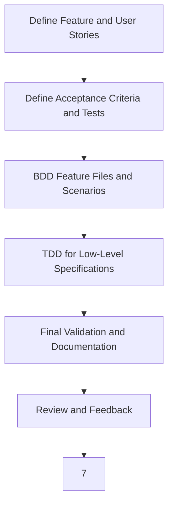
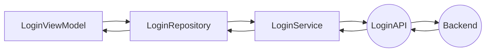
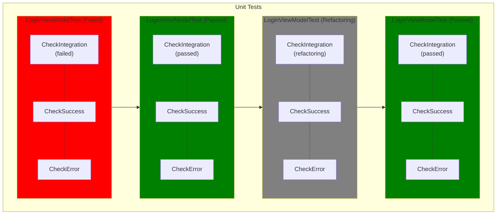
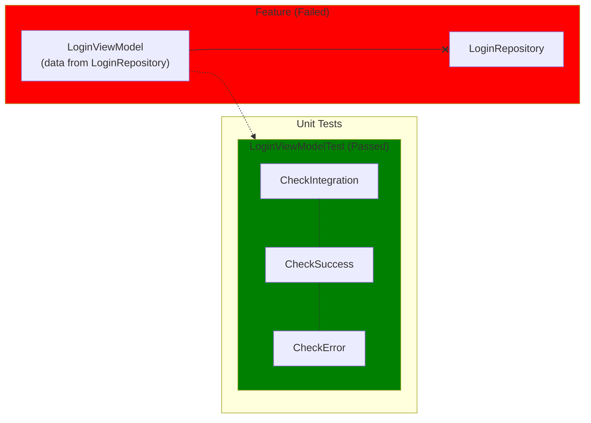
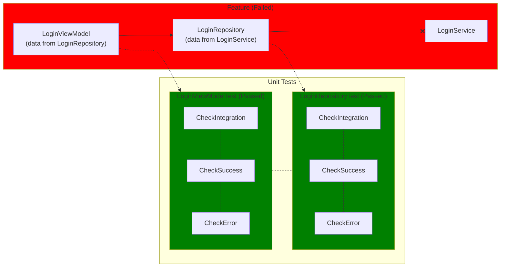
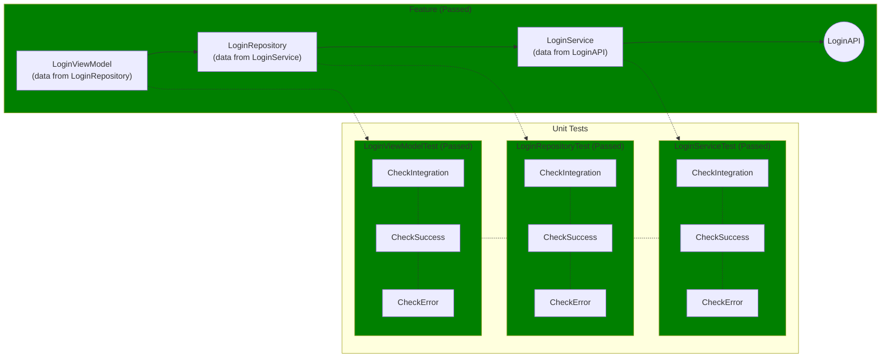
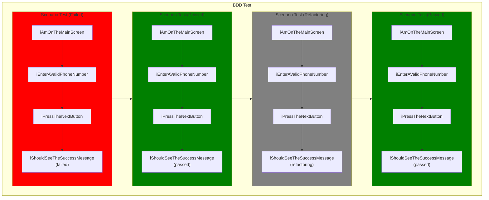
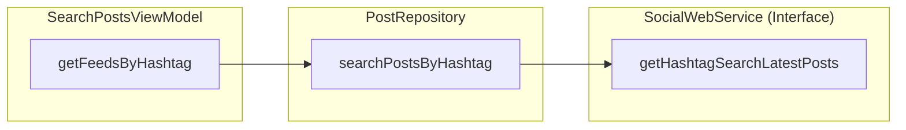
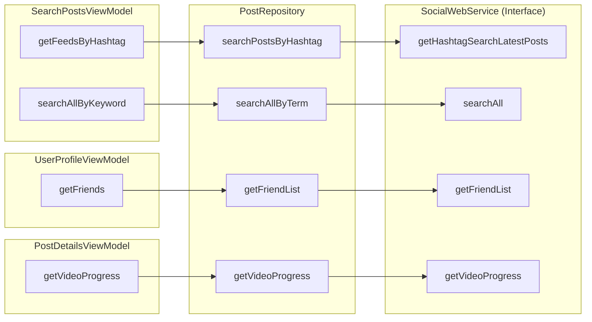

# BrightSocial Test Development Flow

## Introduction

This is the document for a Test Development Flow, which includes Behavior-Driven Development (BDD), Acceptance
Test-Driven Development (ATDD) and Test-Driven Development (TDD).

I will show the basic flow of the development process. After that is going to be the ste-by-step of each phase in the
whole process.

## The flow of development process



Let's have an example that in the first screen of BrightSocial, we have a phone number input.

### 1. Define Feature and User Stories

- Gather input from business stakeholders, developers, and testers to define the feature and create user stories.
- For this example, let's just say the user stories is quite simple: Users type their phone number into the input, and
  press next.

### 2. Define Acceptance Criteria and Tests

- For each user story, collaboratively define clear acceptance criteria that specify the conditions to be met.
- Translate these criteria into high-level acceptance tests, focusing on user interactions and overall system behavior.
  **Also, the acceptance test can be used as the back-bone of the unit test in TDD.**
- For this example, their will be 2 acceptance tests: Show "Success" text when type the valid phone number, and show "
  Error" when the phone number is invalid.

```Kotlin
    @Test
    fun whenUserTypeValidPhoneNumber_thenShowSuccess() {
        // Simulate user typing a valid phone number
        onView(withId(R.id.phone_number_input_field)).perform(typeText("1234567890"))

        // Simulate user clicking the next button
        onView(withId(R.id.next_button)).perform(click())
        
        // Should have a loading here. Let's pretend the API call and process takes almost no time. 

        // Check if the success message is displayed
        onView(withId(R.id.result_message)).check(matches(withText("Success")))
    }

    @Test
    fun whenUserTypeInvalidPhoneNumber_thenShowError() {
        // Simulate user typing an invalid phone number
        onView(withId(R.id.phone_number_input_field)).perform(typeText("invalid"))

        // Simulate user clicking the next button
        onView(withId(R.id.next_button)).perform(click())

        // Check if the error message is displayed
        onView(withId(R.id.result_message)).check(matches(withText("Error")))
    }
```

### 3. BDD Feature Files and Scenarios

- Using the user stories and acceptance criteria, write feature files in a
  domain-specific language (e.g., Gherkin). Include scenarios with given-when-then statements.
- Ensure that each user story is represented with specific scenarios in the
  feature files.
- For this example, there will be 2 "scenarios" which show the step-by-step user actions.

```
Feature: User Login

  Scenario: User enters a valid phone number
    Given I am on the main screen
    When I enter a valid phone number "1234567890"
    And I press the next button
    Then I should see the success message

  Scenario: User enters an invalid phone number
    Given I am on the main screen
    When I enter an invalid phone number "invalid"
    And I press the next button
    Then I should see the error message
```

And the respective native code to simulate each step from scenario.

```Kotlin
    @Given("I am on the main screen")
    fun iAmOnTheMainScreen() {
        // Here you can add code to navigate to the main screen if needed
    }

    @When("I enter a valid phone number {string}")
    fun iEnterAValidPhoneNumber(phoneNumber: String) {
        onView(withId(R.id.phone_number_input_field)).perform(typeText(phoneNumber))
    }

    @When("I enter an invalid phone number {string}")
    fun iEnterAnInvalidPhoneNumber(phoneNumber: String) {
        onView(withId(R.id.phone_number_input_field)).perform(typeText(phoneNumber))
    }

    @When("I press the next button")
    fun iPressTheNextButton() {
        onView(withId(R.id.next_button)).perform(click())
    }

    @Then("I should see the success message")
    fun iShouldSeeTheSuccessMessage() {
        onView(withId(R.id.success_message)).check(matches(withText("Success")))
    }

    @Then("I should see the error message")
    fun iShouldSeeTheErrorMessage() {
        onView(withId(R.id.error_message)).check(matches(withText("Error")))
    }
```

...Wait, why does the BDD tests look kind of the same with the Feature tests ?
Well, in this case, the process and result is going around a user behavior (input the phone number, press next, show
result).

There will be non-UI feature tests (getting and calculate data), or test that doesn't include user actions.

### 4. TDD for Low-Level Specifications

- Before implementing the feature, write a failing unit test for the smallest
  piece of functionality.
- Write just enough code to make the test pass, focusing on functionality.
- For this example, we will split units base on each "step" of the data which is sent after the phone input.
  Here is the data flow.



- We will create unit test for ```LoginViewModel```, ```LoginRepository``` and ```LoginService``` (LoginAPI is an
  interface, so it's impossible to write test for that)
- Every unit will have their own test suite. We will do the red-green-refactor cycle for each unit.

#### 4.1 ViewModel Unit Test



<procedure title="Red-Green-Refactor cycle" id="UnitTestCycle">
    <step>
        <p>Try to make all the tests passed</p>
    </step>
    <step>
        <p>Refactoring all the tests</p>
    </step>
    <step>
        <p>Run tests and fix until it's passed</p>
    </step>
    <step>
        <p>Loop till satisfied</p>
    </step>
</procedure>



```Kotlin
    @Test
    fun checkIntegration() = runTest {
        val viewModel = mockSuccessfulCase()
        viewModel.response.getValueForTest()
        verify(repository, times(1)).login(phoneNumber)
    }

    @Test
    fun checkSuccess() = runTest {
        val viewModel = mockSuccessfulCase()
        assertEquals(expected, viewModel.response.getValueForTest())
    }

    @Test
    fun checkError() = runTest {
        val viewModel = mockFailureCase()
        assertEquals(error, viewModel.response.getValueForTest())
    }
```

<procedure title="LoginViewModelTest" id="LoginViewModelTest">
    <step>
        <p>Write the test to check the ViewModel Unit. The input and output will be mocked because you have to test the
unit alone.</p>
    </step>
    <step>
        <p>Back to the Feature Test. Now you will see the Feature Test will fail since the repository hasn't been defined</p>
    </step>
</procedure>

#### 4.2 Repository Unit Test



<procedure title="LoginRepositoryTest" id="LoginRepositoryTest">
    <step>
        <p>The test is kind of the same with LoginViewModelTest</p>
    </step>
    <step>
        <p>Back to the Feature Test. Now you will see the Feature Test will fail since the service hasn't been defined</p>
    </step>
</procedure>

#### 4.3 Service Unit Test... and so on



<procedure title="LoginServiceTest" id="LoginServiceTest">
    <step>
        <p>The test is kind of the same with LoginViewModelTest and LoginRepositoryTest</p>
    </step>
    <step>
        <p>Back to the Feature Test. Now you will see the Feature Test will pass since all the module is tested successfully.
<b>It also means the Feature Test from ATDD is passed.</b></p>
    </step>
</procedure>

### 5. Back to the BDD Tests

- Run all the scenario tests of the BDD Test suite again.
- This test suite is also work with red-green-refactor cycle.




### 6. Review and Feedback

- **Collaborate and Review:** Regularly review the feature with stakeholders, including running the BDD scenarios and
  acceptance tests to demonstrate the current state.
- **Iterative Feedback and Improvement:** Use feedback from these reviews to iteratively improve the feature, updating
  tests and code as necessary.

### 7. Final Validation and Documentation

- **Validate Against Acceptance Criteria:** Ensure the final product meets all the defined acceptance criteria and
  fulfills the user stories.
- **Document the Feature:** Document the feature, including how it was developed, key decisions made, and how tests were
  used to guide development.

This integrated approach ensures that each phase of development is guided by tests, from high-level behavior and
acceptance tests to low-level unit tests, leading to a well-tested, robust feature that meets both the technical and
business requirements.

## Current Status of BrightSocial

For the Android version of BrightSocial, the data flow is actually almost the same with the example above, except the ```xService``` is actually the interface than the ```xAPI```.
For example, I'm taking the ```getFeedsByHashtag``` function as the example.




At first, it still looks divided just like the example. But the problem is every ```ViewModel```(s) are actually using the same ```PostRepository```. For example




The ```PostRepository``` is not a "unit" but a "monolith". So when creating tests for the feature (let's say we need 3 tests for each unit: integration test, success test and error test).

Which means, in the example, ```SearchPostsViewModel``` will have 6 tests for 2 functions, ```UserProfileViewModel``` will have 3 tests for 1 function, and ```PostDetailsViewModel``` will have 3 tests for 1 function.

And in the ```PostRepository```, we will have 12 tests, for 3 different features, which makes a complex test suite.
**Currently, there are about ~90 APIs, which are ~90 functions in repository, which means you need ~270 function test**. 
You have to control which test is for which feature (and to be honest, you can't) because you will run feature test many times in the whole lifetime of the product.

Also with this "monolith", it's hard to do parallel development since everyone has to access to this repository.

So my proposed solution is to split the repository into smaller repositories for each feature. But it is still going to need a lot of time since the product is already go too far, and already in the production.

That's why, I think we should start with the new product, make it a "lab project". When the method is proven, we can apply it to the current product.


## FAQ
**Q:** Do we need all three types of tests (BDD, ATDD, TDD) ?

**A:** No. Because it's not always possible to have all three types of tests. 
For example you can't do BDD tests for a function that doesn't have any user interaction.