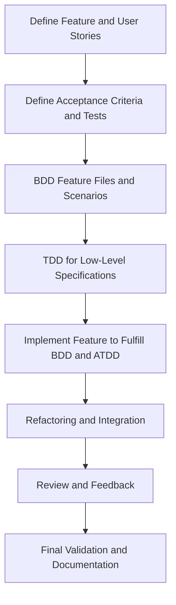
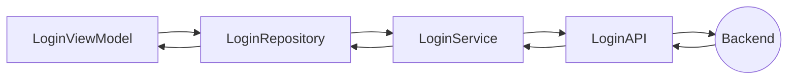

# BrightSocial Test Development Flow

## Introduction

This is the document for a Test Development Flow, which includes Behavior-Driven Development (BDD), Acceptance
Test-Driven Development (ATDD) and Test-Driven Development (TDD).

I will show the basic flow of the development process. After that is going to be the ste-by-step of each phase in the
whole process.

## The flow of development process



Let's have an example that in the first screen of BrightSocial, we have a phone number input.

### 1. Define Feature and User Stories

- Gather input from business stakeholders, developers, and testers to define the feature and create user stories.
- For this example, let's just say the user stories is quite simple: Users type their phone number into the input, and press next.

### 2. Define Acceptance Criteria and Tests

- For each user story, collaboratively define clear acceptance criteria that specify the conditions to be met.
- Translate these criteria into high-level acceptance tests, focusing on user interactions and overall system behavior.
**Also, the acceptance test will actually be the back-bone of the unit test.**
- For this example, their will be 2 acceptance tests: Show "Success" text when type the valid phone number, and show "Error" when the phone number is invalid.

```Kotlin
    @Test
    fun whenUserTypeValidPhoneNumber_thenShowSuccess() {
        // Simulate user typing a valid phone number
        onView(withId(R.id.phone_number_input_field)).perform(typeText("1234567890"))

        // Simulate user clicking the next button
        onView(withId(R.id.next_button)).perform(click())
        
        // Should have a loading here. Let's pretend the API call and process takes almost no time. 

        // Check if the success message is displayed
        onView(withId(R.id.result_message)).check(matches(withText("Success")))
    }

    @Test
    fun whenUserTypeInvalidPhoneNumber_thenShowError() {
        // Simulate user typing an invalid phone number
        onView(withId(R.id.phone_number_input_field)).perform(typeText("invalid"))

        // Simulate user clicking the next button
        onView(withId(R.id.next_button)).perform(click())

        // Check if the error message is displayed
        onView(withId(R.id.result_message)).check(matches(withText("Error")))
    }
```

### 3. BDD Feature Files and Scenarios

- Using the user stories and acceptance criteria, write feature files in a
  domain-specific language (e.g., Gherkin). Include scenarios with given-when-then statements.
- Ensure that each user story is represented with specific scenarios in the
  feature files.
- For this example, there will be 2 "scenarios" which show the step-by-step user actions.

```
Feature: User Login

  Scenario: User enters a valid phone number
    Given I am on the main screen
    When I enter a valid phone number "1234567890"
    And I press the next button
    Then I should see the success message

  Scenario: User enters an invalid phone number
    Given I am on the main screen
    When I enter an invalid phone number "invalid"
    And I press the next button
    Then I should see the error message
```
And the respective native code to simulate each step from scenario.

```Kotlin
    @Given("I am on the main screen")
    fun iAmOnTheMainScreen() {
        // Here you can add code to navigate to the main screen if needed
    }

    @When("I enter a valid phone number {string}")
    fun iEnterAValidPhoneNumber(phoneNumber: String) {
        onView(withId(R.id.phone_number_input_field)).perform(typeText(phoneNumber))
    }

    @When("I enter an invalid phone number {string}")
    fun iEnterAnInvalidPhoneNumber(phoneNumber: String) {
        onView(withId(R.id.phone_number_input_field)).perform(typeText(phoneNumber))
    }

    @When("I press the next button")
    fun iPressTheNextButton() {
        onView(withId(R.id.next_button)).perform(click())
    }

    @Then("I should see the success message")
    fun iShouldSeeTheSuccessMessage() {
        onView(withId(R.id.success_message)).check(matches(withText("Success")))
    }

    @Then("I should see the error message")
    fun iShouldSeeTheErrorMessage() {
        onView(withId(R.id.error_message)).check(matches(withText("Error")))
    }
```


...Wait, why does the BDD tests look kind of the same with the Feature tests ?
Well, in this case, the process and result is going around a user behavior (input the phone number, press next, show result).

There will be non-UI feature tests (getting and calculate data), or test that doesn't include user actions.

### 4. TDD for Low-Level Specifications

- Before implementing the feature, write a failing unit test for the smallest
  piece of functionality.
- Write just enough code to make the test pass, focusing on functionality.
- For this example, we will split units base on each "step" of the data which is sent after the phone input.
Here is the data flow.



- We will create unit test for ```LoginViewModel```, ```LoginRepository``` and ```LoginService``` (LoginAPI is an interface, so it's impossible to write test for that)

### 5. Implement Feature to Fulfill BDD and ATDD

- **Develop Feature:** Write code to meet the behavior described in BDD scenarios and to pass the ATDD acceptance tests.
- **Continuously Integrate TDD:** Throughout development, continuously write new tests and code in small increments,
  following the TDD cycle.

### 6. Refactoring and Integration

- **Refactor Code:** After passing tests, refactor the code for optimization, readability, and maintainability without
  changing its external behavior.
- **Integrate and Test:** Continuously integrate all parts of the feature, ensuring that all unit tests (TDD), feature
  file scenarios (BDD), and acceptance tests (ATDD) pass.

### 7. Review and Feedback

- **Collaborate and Review:** Regularly review the feature with stakeholders, including running the BDD scenarios and
  acceptance tests to demonstrate the current state.
- **Iterative Feedback and Improvement:** Use feedback from these reviews to iteratively improve the feature, updating
  tests and code as necessary.

### 8. Final Validation and Documentation

- **Validate Against Acceptance Criteria:** Ensure the final product meets all the defined acceptance criteria and
  fulfills the user stories.
- **Document the Feature:** Document the feature, including how it was developed, key decisions made, and how tests were
  used to guide development.

This integrated approach ensures that each phase of development is guided by tests, from high-level behavior and
acceptance tests to low-level unit tests, leading to a well-tested, robust feature that meets both the technical and
business requirements.

