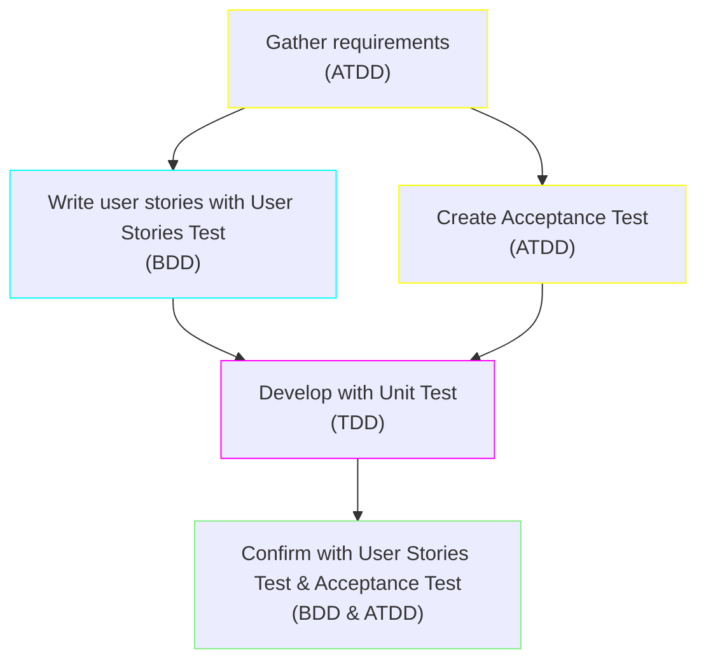

# BrightSocial Test Development Flow

## Introduction
This is the document for a Test Development Flow, which includes Behavior-Driven Development (BDD), Acceptance Test-Driven Development (ATDD) and Test-Driven Development (TDD).

I will show the basic flow of the development process. After that is going to be the ste-by-step of each phase in the whole process.

## The flow of development process

The graph above is the development flow which involves all 3 of the Test Developments.

##### ATDD (Acceptance Test-Driven Development)

